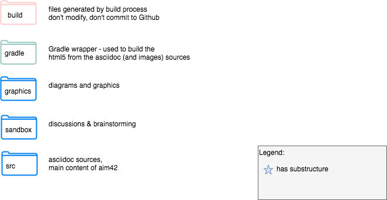
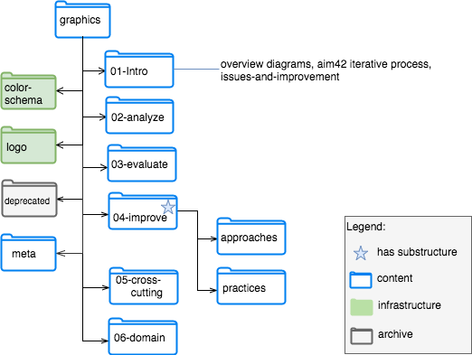

#  Architecture Improvement Method

## Software Evolution, Maintenance and Improvement - Done Right!

[aim42](http://aim42.org) is collection of practices and patterns to support software evolution, maintenance, evolution and improvement of software systems.

aim42 divides change activities in three distinct phases:

* **analyze** issues, risks, problems, symptoms and technical debt within software (and their organisations).
* **evaluate** those issues, identify root-causes and remedies, prioritize.
* **improve** by applying appropriate remedies, strategies and tactics.

aim42 has been founded by [Gernot Starke](http://gernotstarke.de), is supported by [innoQ Deutschland GmbH](http://innoq.com) and is licenced under the
liberal [Creative Commons Sharealike 4.0](http://creativecommons.org/licenses/by-sa/4.0) licence.

### Learn more

* our [project homepage](http://aim42.org) gives an overview
* the [online method guide](http://aim42.github.io) provides all (currently available) details (this is our main artifact - currently under intensive development). The method guide is automatically updated with every commit pushed to the central repository by Travis-CI.

### Contribute

* found mistakes or ommissions: create an [issue](https://github.com/aim42/aim42/issues)
* have ideas: fork the [repository](https://github.com/aim42/aim42) and create a pull request. You need a basic understanding of [Git](http://git-scm.com) for this.
* follow us on [twitter](https://twitter.com/arc_improve42)

We write the content in [AsciiDoc](http://asciidoctor.org/docs/asciidoc-syntax-quick-reference/) and
build with [Gradle](https://gradle.org).

As of September 2017, we removed the AsciiDoc help from the aim42 guide,
you can find it [here](), under the arc42 organization.

### Current Status

## Repository Organization

#### Top-Level

(Original drawn with [draw.io](https://draw.io), source located in /graphics/meta/aim42-repo-structure.xml)

#### Graphics

Both diagrams created with (desktop-version of) [draw.io](https://draw.io), source located in /graphics/meta/aim42-repo-structure.xml)
