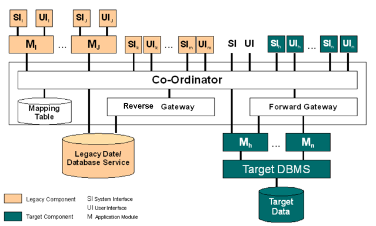

[[composite-database-approach]]
==== [pattern]#Composite Database Approach#

===== Intent

===== Description

In Composite Database approach, the legacy
information system and its target information system are
operated in parallel throughout the migration project.
The target applications are gradually rebuilt on the
target platform using modern tools and technology.
Initially the target system will be quite small but will
grow as the migration progresses.  Eventually the target
system should perform all the functionality of the
legacy system and the old legacy system can be retired.

During the migration, the old legacy system and its
target system form a composite information system, as
shown in Fig. 1, employing a
combination of forward and reverse gateways.  The
approach may involve data being duplicated across both
the legacy database and the target database.  To
maintain data integrity, a Transaction Co-ordinator is
employed which intercepts all update requests, from
legacy or target applications, and processes them to
identify whether they refer to data replicated in both
databases.  If they do, the update is propagated to both
databases using a two-phase commit protocol as for
distributed database systems.

Analysing non-decomposable legacy components
can be very difficult.  In the worst case the component
must be treated as a black box.  The best that can be
achieved is to discover its functionality and try to elicit
as much legacy data as possible.  Sometimes using
existing legacy applications, (e.g., database query,
report generation, and access routines), is the only way
to extract the legacy data.  Once the functionality has
been ascertained, the component can be re-developed
from scratch.  It can often be very difficult to identify
when legacy data or functions are independent; in many
cases they may simply have to be replicated and target
copies co-ordinated until the entire legacy system can
be safely retired.

The Composite Database approach eliminates the
need for a single large migration of legacy data as
required in the Database First and Database Last
approaches. This is significant in a mission critical
environment. However, this approach suffers from the
overhead not only of the other two approaches but also
the added complexity introduced by the co-ordinator.

(taken from BISBAL, J. et.al.)

===== Experiences

===== Risks

===== Applicability

The Composite Database approach is
applicable to fully decomposable, semi-decomposable
and non-decomposable legacy systems.  In reality, few
legacy systems fit easily into a single category.  Most
legacy systems have some decomposable components,
some which are semi-decomposable and others which
are non-decomposable, i.e.  what is known as a Hybrid
Information System architecture.

===== Consequences

===== Also Known As

===== Related Patterns

* <<Chicken-Little Strategy>>

===== References

* BISBAL, J. et.al.; A Survey of Research into Legacy System Migration. Technical Report TCD-CS-1997-01, Computer Science Department, Trinity College Dublin, 1997. http://citeseerx.ist.psu.edu/viewdoc/summary?doi=10.1.1.50.9051 

// end of list
